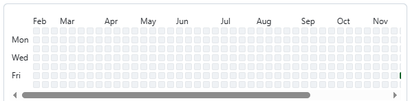
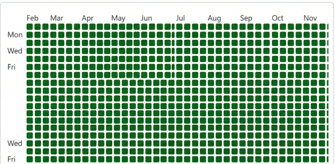

<br />
<div align="center">
  <a href="https://github.com/jikssha/github-green">
    
  </a>

  <h1 align="center">🌱 Github Green 自动保号常绿脚本</h1>

  <p align="center">
    <b>GitHub 贡献图绿意盎然</b>
    <br />
    Keep your GitHub contribution graph green
    <br />
    <br />
    <a href="https://github.com/jikssha/github-green/actions">
      
    </a>
    <a href="https://github.com/jikssha/github-green/stargazers">
      
    </a>
    <a href="https://github.com/jikssha/github-green/blob/main/LICENSE">
      
    </a>
  </p>
</div>

---

## 🤖Github green 常绿活跃 — 一键部署指南

Github green可以让你的 GitHub 账号每天自动、随机提交代码，让贡献日历保持自然活跃。
它利用 GitHub Actions 定时触发脚本，在不同时间点生成随机提交。
不同于那些只会机械式每天提交一次的笨拙脚本，本项目专注于**"模拟真实人类行为"**。它会在随机的时间、产生随机数量的提交，甚至偶尔"偷懒"不提交，从而生成一张看起来完全自然的贡献热力图。

### 🚀 一键部署步骤

### 第 1 步：创建仓库

> ⚠️ **重要提示**：请使用 **Use this template**，不要使用 Fork！
> Fork 仓库产生的 commit 不会计入你的 GitHub 贡献热力图。

1. 打开本模板仓库页面。
2. 点击右上角 **Use this template → Create a new repository**。
3. 填写仓库名称（如 `my-green`），勾选 **Private**（推荐），点击 **Create repository**。

### 第 2 步：设置 Secrets

1. 打开你的新仓库 → **Settings → Secrets and variables → Actions**。
2. 点击 **New repository secret**，添加以下变量：

| Secret 名称 | 必填 | 说明 |
|-------------|------|------|
| `ACTOR_NAME` | ✅ 必填 | 你的 GitHub 用户名（如 `jiksska`） |
| `ACTOR_EMAIL` | ⚪ 可选 | 不填则自动生成 `{用户名}@users.noreply.github.com` |
| `PUSH_TOKEN` | ⚪ 可选 | 个人访问令牌（PAT），默认使用 Actions 自带 Token |

### 第 3 步：运行参数（可选修改）
工作流默认每天分散在 **6 个时间点** 自动运行（模拟全球用户活动）：
- 北京时间：09:00 / 13:00 / 17:00 / 21:00 / 01:00 / 05:00

每次运行随机提交 0～4 次。可在 `.github/workflows/commit-random.yml` 中调整参数：
```yaml
SKIP_PROB: "0.09"               # 休息概率（周末自动翻倍）
MAX_COMMITS: "4"                # 每次运行最多提交次数
MIN_SLEEP: "15"                 # 提交间最短等待（秒）
MAX_SLEEP: "90"                 # 提交间最长等待（秒）
MAX_START_DELAY_MINUTES: "60"   # 启动前随机延迟（分钟）
```

### 第 4 步：运行测试
1. 打开仓库顶部菜单 **Actions**。
2. 选择 `keep github-green` 工作流。
3. 点击 **Run workflow** 手动运行一次。
4. 日志出现 `Pushed commits successfully.` 表示成功。

🎉 **搞定！** 喝杯咖啡，坐等你的 Profile 变绿吧。

## ✨ Features

* 🎲 **智能随机化 (Smart Randomization)**
    * **随机提交次数**：每天可配置 1 到 N 次提交（加权分布，1-2 次概率更高）
    * **随机时间点**：全天 6 个时间点分散触发，模拟全球用户活动
    * **随机跳过**：并不是每天都会运行，模拟真实的"休息日"
    * **🆕 周末休息模式**：周六日跳过概率自动翻倍，更符合人类作息
* ⚡ **GitHub Actions 驱动**
    * 利用 Crontab 定时触发，无需本地运行，设置一次，永久自动运行
* 📝 **动态提交信息**
    * 从 28+ 条预设词库中随机选取 Commit Message，涵盖 chore/docs/fix/style/refactor 等多种类型
* 🔒 **安全隐蔽**
    * 只更新特定的日志文件，绝不污染你的核心代码库
    * 建议将仓库设为 Private

---

## 📊 效果对比

使用本项目后，你的 GitHub 贡献热力图将从这样：

| 使用前 | 使用后 |
|--------|--------|
|  |  |

---

## ❓ FAQ 常见问题

</details>

<details>
<summary><b>如何确认 Actions 正在运行？</b></summary>

1. 进入仓库 → **Actions** 标签页
2. 查看 `keep github-green` 工作流的运行记录
3. 绿色 ✅ 表示成功，点击可查看详细日志

</details>

<details>
<summary><b>会不会被 GitHub 封号？</b></summary>

本项目只是向你自己的仓库提交代码，完全合规。但建议：
- 将仓库设为 **Private**
- 不要过于频繁提交（使用默认配置即可）

</details>

---

## 🤝 Contributing

如果你有更有趣的随机算法，或者想扩充提交信息的词库，欢迎贡献！
